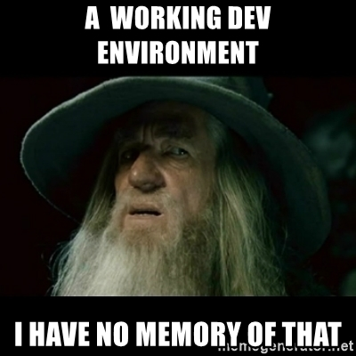

# Examples of slide formatting

## Markdown formatting generally works

Most markdown formatting does exactly what you would expect it to, with a few exceptions.  

Headers are biggest exception.  

You will also get run-on lines if you forget to add two spaces after each line.

---

## Slide Testing to know formatting requirements

In this section we will test:

* Skipping a slide page
* Different Header Levels
* Embedding code
* Bold, italics, and carrot text boxes
* Bullets and Numbers
* Task lists and tables
* Hyperlinks
* Image Links
* Video Links
* Indenting and overloading code embedding
* Overloading slides with too much content
* css pic class with formats: .jpg, .png, .svg
* css extra-details class and creating your own class
* Other css edits for images
* Inline HTML

*Add more pages as you feel helpful

???

## This slide should be skipped

Placing ??? instead of ---
should skip the slide

This slide indeed gets skipped

---

## All Headers look the same

The first slide in an md file always has a level one header.  

All pages that follow are separated by the `---` (dash-dash-dash) on its own line.  

Each page's title starts with a second level header. (Same size at 1st level header)  

Header sizes can be adjusted in the `workshop.css` file, but for now  
All Headers 3+ look the Same!  

### Third level header

#### Fourth level header

##### Fifth level header

---

## Code embedding test 1

We are going to embed code below using markdown syntax  

Bash code block using three backticks:
```bash
docker ps -a
docker rm $(docker ps -lq)
```

Code that is horizontally too long for the slide will get a slider bar:
```md
[](https://www.youtube.com/watch?v=YOUTUBE_VIDEO_ID_HERE)
```
Inserting a screenshot is a good substitute if you don't want a slider bar for your code.

Here is an in-line code highlight using single backticks:  
a basic command, `kubectl get pods -A`, is good to know.

---

## Italics, Bold, Strike-through and Carrots

This can handle both types of syntax for:  

**BOLD** -or- _italics_  

-or-  

*italics* or __bold__  

~~Strikethrough text~~  


\> Carrot Block quotes don't seem to render:  
>Pay attention to this single carrot!
>>Really pay attention to this double!
>>>Triple carrot!  

Carrots seem to indent instead of highlight

---

## Bullets and Numbers, etc.
dash and dot syntax both work for bullets.  
Numbering renders correctly if just using 1's  

1. point 1 Level 1
1. Point 2
1. Point 3
  1. indented point 1
  1. indented point 2
      1. The third level needs additional indentation
      1. level 3 pt 2

* bullet point classic
  * second level bullet
      * level 3 has to be indented more for some reason
          * bullet level 4
  * continued second level

- bullet point dash syntax
  - second level dash syntax

---

## Task List and Table

Task lists don't have any special rendering like in gitlab.

- [x] Write the press release
- [ ] Update the website
- [ ] Contact the media


Tables don't render at all unless you are willing to add all the spaces manually  

My table  
| Syntax | Description |  
| ----------- | ----------- |  
| Header | Title |  
| Paragraph | Text |  

---

## Hyperlinks

* [Dev-to-prod reduced from 9 months to 15 minutes (ING)](
  https://gallant-turing-d0d520.netlify.com/docker-case-studies/CS_ING_01.25.2015_1.pdf)

* [Continuous integration job time reduced by more than 60% (BBC)](
  https://gallant-turing-d0d520.netlify.com/docker-case-studies/CS_BBCNews_01.25.2015_1.pdf)

* [Deploy 100 times a day instead of oX^2^(MetLife)](
  https://www.youtube.com/watch?v=Bwt3xigvlj0)

* etc.

Unless you right-click on hyperlinks and direct them to open in a new tab, they will be rendered in place of the slide deck and the back button will need to be used to return to the slides.

---

## Image Hyperlinks

* This yeti picture is from an external site. 

* It is recommended to link to the machine's local images as demonstrated in some of the following slides.

---

## Link to image that links to video

Kubernetes in 100 seconds  (click on the image and it will take you to the video)  
[](https://www.youtube.com/watch?v=dQw4w9WgXcQ)

The basics for a youtube video are:
```md
[](https://www.youtube.com/watch?v=YOUTUBE_VIDEO_ID_HERE)
```

These hyperlinks take over the current browser window however, so you'll have to use the back button to get back to the slide deck.

---

## Other markdown format notes

Using the backslash to escape some formatting characters can cause the slide compilation to fail, but so far only seen when trying to render the text of 3 backticks.


Subscript, Superscript, Highlighting, and footnotes don't work.  
Tab indenting text also has zero effect as you would expect in markdown. 

Subscript  H~2~O

Superscript  X^2^

Highlight these ==very important words==.

	Here's a sentence with a footnote. [^1]

[^1]: This is the footnote.

---

## Indenting and overloading code embedding
* bullet point classic
  * second level bullet  
  code will indent, but some will be lost if it is too long  
  This code gets cut off
  ```yaml
  apiVersion: apps/v1
  kind: Deployment
  metadata:
    name: hello
  spec:
    replicas: 1
    selector:
      matchLabels:
        app: hello
    template:
      metadata:
        labels:
          app: hello
      spec:
        containers:
        - name: hello
          image: nginxdemos/hello
          resources:
            requests:
              memory: "64Mi"
              cpu: "250m"
            limits:
              memory: "128Mi"
              cpu: "500m"
          ports:
          - containerPort: 80
  ```

---


## Text Overloading

Be careful not to overload your slide!  
Too much vertical content will be lost!  

Long lines of text will overrun the right side of the screen do wrap to the left side of the screen. This is typical for any .md file rendering no matter how long the text line is.  

1 I will overload the slide vertically  
2 I will overload the slide vertically  
3 I will overload the slide vertically  
4 I will overload the slide vertically  
5 I will overload the slide vertically  
6 I will overload the slide vertically  
7 I will overload the slide vertically  
8 I will overload the slide vertically  
9 I will overload the slide vertically  
10 I will overload the slide vertically  
11 I will overload the slide vertically  
12 I will overload the slide vertically  
This is one of the last lines visible and there are 8 more to go.  
13 I will overload the slide vertically  
14 I will overload the slide vertically  
15 I will overload the slide vertically  
16 I will overload the slide vertically  
17 I will overload the slide vertically  
18 I will overload the slide vertically  
19 I will overload the slide vertically  
20 I will overload the slide vertically  

---

class: pic

## `class:pic`


---

## Pictures w/o `class:pic`

The `class:pic` seems best suited for slides with just a title and no additional text.
Any title / header will be centered.  

Pictures without using the `class:pic` just show up on the left or after any text that is in front of them.  
Inline text in front  
testing type: .png

---

class: pic

## `class:pic` with text

using `class: pic` at the beginning of the slide creates a centered picture on the page.  
Text above pics will appear on far left with no vertical spacing between text and pic.  


testing type: .jpg  
Text below pics will show if there is enough room - on the far left, No vertical spacing.

---

class: pic

## More testing with `class:pic`

        Trying to get text more centered through indenting or spaces changes font  


testing type: .png

---

class: pic

## More testing with `class:pic` 2

>>>>>>>>Using right carrot to indent keeps text the same


---

class: pic
## More testing with `class:pic` 3

SVG graphics seem to render to the largest size allowed in the space  
  

---
class: pic

## `class:pic` testing 2 pics


Slide is vertically overloaded and This text doesn't appear

---

class: pic

## `class:pic` testing 3 pics


Slide is overloaded with pictures and doesn't show third.

---

class: extra-details

## Extra-details class

1. Extra details class puts a magnifying glass in upper-left corner

2. Could be used for extra-details you might want to skip if running low on time.

---

class: extra-play

## Create your own class

1. A custom class can be made that will place a custom image in the upper-left corner of the slide. (or anywhere depending on how you edit the css)

2. Could be used to indicate special slides such as participation slides, etc...

3. To add the class, edit the `workshop.css` file

4. Somewhere around line 219, add a div section that points to the desired image.

  ```css
  div.play {
    background-image: url("images/XboxOne-dark.png");
    background-position: 0.5% 1%;
    background-size: 4%;
  }
  ```

---

class: extra-jedi

## Another custom class example

1. The css that creates this custom class places the image in the lower right.

1. You don't have to be a Jedi Master to accomplish this.

---

## Other images & css edits

small images can be added to the beginning of a line of text by editing the `workshop.css` file.

Add code similar to the blackbelt and warning sections to create a custom image
```css
.blackbelt {
  background-image: url("images/blackbelt.png");
  background-size: 1.5em;
  background-repeat: no-repeat;
  padding-left: 2em;
  background-position: left;
}
```
.warning[This is text that would follow the warning symbol] 
.blackbelt[You can even put hyperlinks following these
([video](https://www.youtube.com/shorts/lasOgh1ukvc))]
.jedi[Be careful trying to be a jedi master ([GIF](https://media.giphy.com/media/l3fZXnX7OsHuj9zDq/giphy.gif))]

---

## Labs

Using the `.lab[ <your content here>]` in slides creates a keyboard and border around the content

.lab[

- In one terminal, watch namespaces:
  ```bash
  kubectl get namespaces --show-labels -w
  ```

- In the other, update our namespace:
  ```bash
  kubectl label namespaces hello color=purple
  ```

]
---

  
  ## Inline HTML
  
  HTML seems to get copied over and rendered appropriately, but would be a lot of extra work for little reward. 
  
  <dl>
    <dt>Definition list</dt>
    <dd>Is something people use sometimes.</dd>
  
    <dt>Markdown in HTML</dt>
    <dd>Does *not* work **very** well. Use HTML <em>tags</em>.</dd>
  </dl>
  